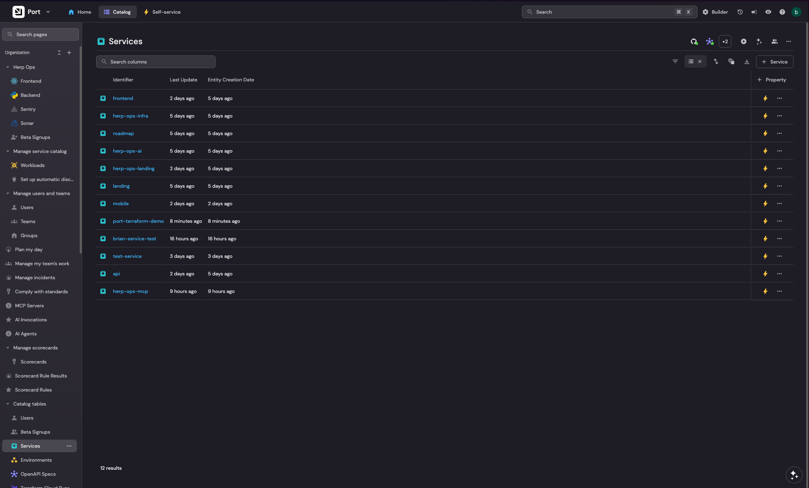
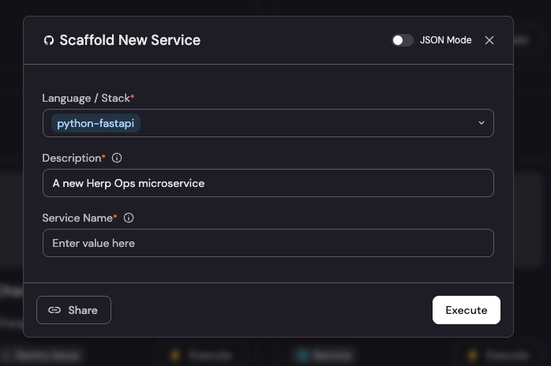
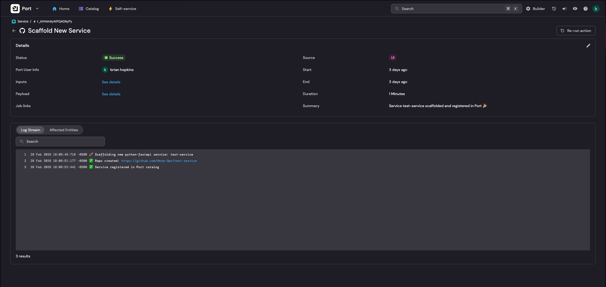
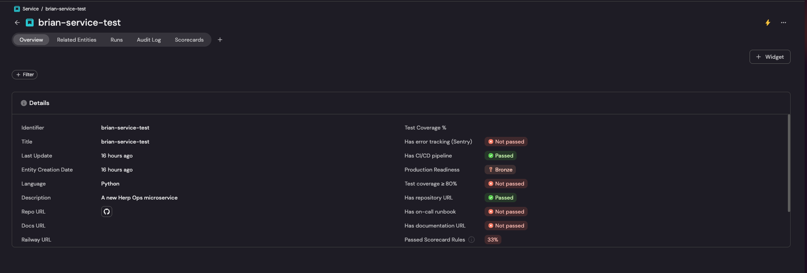
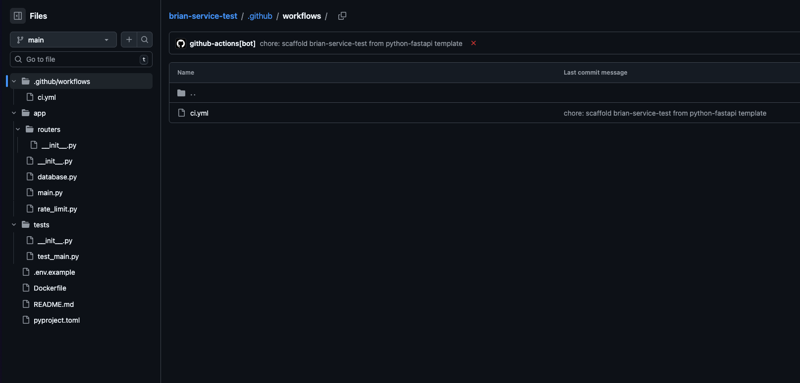

# Port.io Internal Developer Portal — Terraform Configuration Demo

This repository demonstrates how to build a **production-ready Internal Developer Portal (IDP)** using [Port.io](https://getport.io) and [Terraform](https://www.terraform.io). It showcases a complete IDP implementation with blueprints, actions, entities, scorecards, and GitHub Actions integration.

## 📚 Table of Contents

- [What is Port.io?](#what-is-portio)
- [Why Terraform for IDP Configuration?](#why-terraform-for-idp-configuration)
- [Architecture Overview](#architecture-overview)
- [Project Structure](#project-structure)
- [Core Concepts](#core-concepts)
- [Getting Started](#getting-started)
- [Blueprint Catalog](#blueprint-catalog)
- [Self-Service Actions](#self-service-actions)
- [Service Templates](#service-templates)
- [Scorecards & Standards](#scorecards--standards)
- [GitHub Actions Integration](#github-actions-integration)
- [Best Practices](#best-practices)
- [Resources](#resources)

---

## What is Port.io?

**Port.io** is a developer portal platform that creates a **single pane of glass** for your engineering organization. It consolidates:

- **Service Catalog**: All services, APIs, environments, and dependencies
- **Self-Service Actions**: Enable developers to scaffold services, trigger deployments, reset data, etc.
- **Scorecards**: Measure engineering standards (test coverage, security, documentation)
- **Integrations**: GitHub, Jira, Railway, Vercel, Terraform Cloud, SonarQube, PagerDuty, and 80+ more
- **AI Assistant**: Context-aware assistant that knows your services, deployments, and standards

Port solves the "where is everything?" problem by pulling all your infrastructure, code, and tooling into one searchable, queryable catalog.


_Port.io service catalog showing blueprints, entities, and their relationships_

---

## Why Terraform for IDP Configuration?

Managing Port configuration via Terraform (vs. clicking in the UI or calling APIs directly) provides:

✅ **Version Control**: Every blueprint, action, and entity change is code-reviewed and auditable  
✅ **Reproducibility**: Spin up identical dev/staging/prod Port environments from code  
✅ **Collaboration**: Teams can propose changes via pull requests  
✅ **Documentation**: Infrastructure-as-code _is_ documentation  
✅ **Disaster Recovery**: Entire Portal can be rebuilt from git history  
✅ **Automation**: CI/CD validates and applies changes automatically

This repo uses **Terraform Cloud** to manage state and automate deployments, but you can also use local state or other backends.

---

## Architecture Overview

```
┌─────────────────────────────────────────────────────────────────┐
│                         Port.io Platform                        │
│                                                                 │
│  ┌────────────────┐  ┌────────────────┐  ┌────────────────┐     │
│  │   Blueprints   │  │    Entities    │  │   Scorecards   │     │
│  │ (Data Models)  │  │  (Instances)   │  │  (Standards)   │     │
│  └────────────────┘  └────────────────┘  └────────────────┘     │
│                                                                 │
│  ┌────────────────┐  ┌────────────────┐  ┌────────────────┐     │
│  │    Actions     │  │  Integrations  │  │  AI Assistant  │     │
│  │ (Self-Service) │  │  (Sync Data)   │  │  (Context)     │     │
│  └────────────────┘  └────────────────┘  └────────────────┘     │
└─────────────────────────────────────────────────────────────────┘
                              ▲
                              │ Terraform Provider
                              │ (CRUD operations)
                              ▼
┌─────────────────────────────────────────────────────────────────┐
│                    Terraform Configuration                      │
│                                                                 │
│  ┌────────────────────────────────────────────────────────┐     │
│  │  port_blueprint.service                                │     │
│  │  port_blueprint.environment                            │     │
│  │  port_action.scaffold_service                          │     │
│  │  port_scorecard.production_readiness                   │     │
│  │  port_entity.api_production                            │     │
│  └────────────────────────────────────────────────────────┘     │
└─────────────────────────────────────────────────────────────────┘
                              ▲
                              │ GitHub Actions
                              │ (terraform plan/apply)
                              ▼
┌─────────────────────────────────────────────────────────────────┐
│                      GitHub Repository                          │
│                                                                 │
│  terraform/port/                                                │
│    ├── main.tf          (Provider config)                       │
│    ├── blueprints.tf    (Data models)                           │
│    ├── entities.tf      (Seed data)                             │
│    ├── actions.tf       (Self-service actions)                  │
│    └── scorecards.tf    (Engineering standards)                 │
│                                                                 │
│  examples/workflows/                                            │
│    ├── port-tf-sync.yml (Apply changes on merge)                │
│    └── scaffold-service.yml (Triggered by Port action)          │
└─────────────────────────────────────────────────────────────────┘
```

---

## Project Structure

```
port-terraform-demo/
├── README.md                  # This file
├── terraform/
│   └── port/
│       ├── main.tf            # Provider config + Terraform Cloud backend
│       ├── variables.tf       # Input variables
│       ├── outputs.tf         # Output values
│       ├── blueprints.tf      # Blueprint definitions (data models)
│       ├── entities.tf        # Entity instances (seed data)
│       ├── actions.tf         # Self-service actions
│       └── scorecards.tf      # Engineering standards & metrics
├── templates/
│   └── python-fastapi/        # Cookiecutter template for new services
│       ├── cookiecutter.json
│       └── {{cookiecutter.service_name}}/
│           ├── app/           # FastAPI application code
│           ├── tests/         # Pytest tests
│           ├── Dockerfile
│           ├── pyproject.toml # uv + Python dependencies
│           └── .github/workflows/ci.yml
├── examples/
│   └── workflows/             # Example workflows (copy to .github/workflows/)
│       ├── port-tf-sync.yml   # Auto-apply Terraform changes
│       ├── scaffold-service.yml # Self-service action handler
│       └── README.md          # Setup instructions
├── .gitignore
└── LICENSE
```

---

## Core Concepts

### 1. Blueprints (Data Models)

Blueprints define the **schema** for entities in your catalog. Think of them as database tables or classes.

**Example**: A `service` blueprint with properties like `language`, `test_coverage`, and relations to `openapi_spec` and `environment`.

📄 See: [`terraform/port/blueprints.tf`](terraform/port/blueprints.tf)

### 2. Entities (Instances)

Entities are **instances** of blueprints — actual services, environments, or users.

**Example**: An entity `api` of type `service` with properties `language: "Python"`, `test_coverage: 85`.

📄 See: [`terraform/port/entities.tf`](terraform/port/entities.tf)

### 3. Relations

Entities can be linked to each other. A `service` has many `environments`. An `environment` belongs to one `service`.

Port automatically creates a graph view showing these relationships.

### 4. Actions (Self-Service)

Actions are **workflows** triggered by developers from the Port UI. They can:

- Scaffold new services from templates
- Trigger deployments
- Create beta invites
- Reset demo data

Actions are implemented as GitHub Actions workflows (or other backends like Jenkins, Argo, AWS Lambda).

📄 See: [`terraform/port/actions.tf`](terraform/port/actions.tf)

### 5. Scorecards

Scorecards **measure engineering standards** across services:

- **Bronze**: Has CI/CD pipeline
- **Silver**: Has error tracking, 70%+ test coverage
- **Gold**: 90%+ coverage, on-call runbook, zero bugs

Services are automatically scored based on their properties.

📄 See: [`terraform/port/scorecards.tf`](terraform/port/scorecards.tf)

---

## Getting Started

### Prerequisites

- **Terraform** >= 1.5
- **Port.io account** (free tier available at [getport.io](https://getport.io))
- **Port API credentials** (Client ID + Secret from Port settings)
- **Terraform Cloud account** (optional but recommended for remote state)

### 1. Clone the Repository

```bash
git clone https://github.com/yourusername/port-terraform-demo.git
cd port-terraform-demo/terraform/port
```

### 2. Create Port API Credentials

1. Log in to [Port.io](https://app.getport.io)
2. Go to **Settings → API Credentials**
3. Create a new **Client ID** and **Client Secret**
4. Save these securely

### 3. Configure Terraform Backend

Update [`main.tf`](terraform/port/main.tf) with your Terraform Cloud organization:

```hcl
terraform {
  cloud {
    organization = "your-org-name"
    workspaces {
      name = "port-demo"
    }
  }
}
```

Or use a local backend:

```hcl
terraform {
  backend "local" {
    path = "terraform.tfstate"
  }
}
```

### 4. Set Variables

Create a `terraform.tfvars` file:

```hcl
port_client_id     = "your_client_id"
port_client_secret = "your_client_secret"
github_org         = "your-github-org"
```

**⚠️ Never commit secrets to git!** Use Terraform Cloud sensitive variables or environment variables instead:

```bash
export TF_VAR_port_client_id="your_client_id"
export TF_VAR_port_client_secret="your_client_secret"
```

### Using a Secrets Manager (Doppler, 1Password, Vault, etc.)

**Best Practice:** Avoid writing secrets like API keys or client secrets in plain text files (such as `terraform.tfvars`) or as environment variables in your shell history. Use a dedicated secrets manager (like [Doppler](https://www.doppler.com/), [1Password](https://developer.1password.com/docs/secrets/), [HashiCorp Vault](https://www.vaultproject.io/), [AWS Secrets Manager](https://aws.amazon.com/secrets-manager/), etc.) to securely inject these values into your CI/CD workflows or Terraform commands.

#### Example: Using Doppler

1. [Install Doppler CLI](https://docs.doppler.com/docs/install-cli)
2. Authenticate your session and select the workspace:

   ```bash
   doppler login
   doppler setup
   ```

3. Run Terraform with secrets injected as environment variables:

   ```bash
   doppler run -- terraform apply
   ```

   This automatically injects variables like `TF_VAR_port_client_id` and `TF_VAR_port_client_secret` from Doppler into Terraform **without ever storing them in source code or environment files**.

#### Example: Using 1Password

If you use [1Password CLI](https://developer.1password.com/docs/cli/):

```bash
export TF_VAR_port_client_id=$(op read "op://Project/Port Client ID")
export TF_VAR_port_client_secret=$(op read "op://Project/Port Client Secret")
terraform apply
```

#### General Pattern

Most secrets managers let you inject env vars at runtime for CI/CD or your local session. Configure your secrets manager to provide:

- `TF_VAR_port_client_id`
- `TF_VAR_port_client_secret`
- Any other sensitive variables needed for Terraform

> **Tip:** Review your secrets manager's documentation for best practices integrating with Terraform or CI platforms.

### 5. Initialize and Apply

```bash
terraform init
terraform plan   # Review changes
terraform apply  # Apply to Port
```

🎉 Your Port catalog is now live! Visit [app.getport.io](https://app.getport.io) to see your blueprints and entities.

---

## Blueprint Catalog

This demo includes the following blueprints:

| Blueprint             | Description                                                            |
| --------------------- | ---------------------------------------------------------------------- |
| **service**           | A deployable microservice with language, coverage, and deployment info |
| **environment**       | A deployed environment (dev/staging/production) for a service          |
| **openapi_spec**      | OpenAPI/Swagger spec for an API service                                |
| **betaSignup**        | Beta waitlist signups from your landing page                           |
| **user**              | Authenticated users in your application                                |
| **githubRepository**  | GitHub repos (managed by GitHub Ocean integration)                     |
| **githubPullRequest** | GitHub PRs (managed by GitHub Ocean integration)                       |
| **sonarQubeProject**  | SonarQube/SonarCloud projects (managed by SonarQube integration)       |

Each blueprint has properties (strings, numbers, booleans, objects) and relations to other blueprints.

---

## Self-Service Actions

This demo includes these self-service actions:

### 1. **Scaffold New Service**

**Trigger**: From the Service catalog page  
**What it does**: Creates a new GitHub repo from a Cookiecutter template and registers it in Port  
**Implementation**: [`scaffold-service.yml`](examples/workflows/scaffold-service.yml)

**Developer experience**:

1. Click "Scaffold New Service" in Port
2. Enter service name, description, language
3. Port triggers GitHub Actions workflow
4. Workflow creates repo + pushes code + registers in Port
5. Developer gets a link to the new repo in Port


_Clicking "Scaffold New Service" in Port and filling out the form_


_Real-time logs showing repo creation and Port registration_


_Newly scaffolded service automatically registered in Port catalog_

### 2. **Trigger Deployment**

**Trigger**: From a Service detail page (Day-2 action)  
**What it does**: Deploys a service to staging or production  
**Implementation**: Dispatches a `deploy-production.yml` workflow

### 3. **Send Beta Invite**

**Trigger**: From a Beta Signup entity (Day-2 action)  
**What it does**: Sends onboarding email and updates status to "invited"  
**Implementation**: Dispatches a `send-beta-invite.yml` workflow

---

## Service Templates

The `templates/` directory contains [Cookiecutter](https://cookiecutter.readthedocs.io/) templates used by the **Scaffold New Service** action. When a developer triggers the action in Port, the workflow uses these templates to generate a new repository with all the boilerplate code.

### Python FastAPI Template

**Location**: [`templates/python-fastapi/`](templates/python-fastapi/)

**What's included**:

- **FastAPI application** with health check endpoint
- **SQLAlchemy** database configuration
- **Rate limiting** using slowapi
- **Sentry** error tracking integration
- **CORS** middleware configuration
- **pytest** test suite with coverage reporting
- **Ruff** linting configuration
- **uv** for fast dependency management
- **Dockerfile** optimized for production
- **GitHub Actions CI** workflow that:
  - Runs tests with coverage
  - Lints code with Ruff
  - Updates Port entity with latest test coverage


_Newly generated Python FastAPI service repository from template_

### Template Structure

```
templates/python-fastapi/
├── cookiecutter.json           # Template variables
└── {{cookiecutter.service_name}}/
    ├── app/
    │   ├── main.py             # FastAPI app entry point
    │   ├── database.py         # SQLAlchemy setup
    │   ├── rate_limit.py       # slowapi configuration
    │   └── routers/            # Add feature routers here
    ├── tests/
    │   └── test_main.py        # Basic smoke tests
    ├── .github/
    │   └── workflows/
    │       └── ci.yml          # CI pipeline + Port integration
    ├── Dockerfile              # Multi-stage production build
    ├── pyproject.toml          # uv dependencies + tool config
    ├── .env.example            # Environment variables template
    ├── .gitignore
    └── README.md               # Service-specific documentation
```

### How It Works

1. **Developer triggers action** in Port UI
2. **Port dispatches** GitHub workflow with inputs (service name, description, language)
3. **Workflow runs cookiecutter** to generate code from template:
   ```bash
   cookiecutter templates/python-fastapi \
     --no-input \
     service_name="acme-notifications" \
     service_description="Email notification service"
   ```
4. **Workflow creates GitHub repo** and pushes generated code
5. **Workflow registers service** in Port catalog via API
6. **Developer receives link** to new repository

### Customizing Templates

To add a new template (e.g., `typescript-nextjs`):

1. Create `templates/typescript-nextjs/cookiecutter.json`
2. Add template files in `templates/typescript-nextjs/{{cookiecutter.service_name}}/`
3. Update `terraform/port/actions.tf` to include new language option:
   ```hcl
   enum = ["python-fastapi", "typescript-nextjs", "go-fiber"]
   ```
4. Update `examples/workflows/scaffold-service.yml` to handle new template

### Port Coverage Integration

The CI workflow automatically updates Port with test coverage after each main branch build:

```bash
COVERAGE=$(grep -oP 'TOTAL.*?\K[\d.]+(?=%)' coverage.xml)
curl -X PATCH "https://api.getport.io/v1/blueprints/service/entities/$SERVICE_NAME" \
  -H "Authorization: Bearer $TOKEN" \
  -d "{\"properties\":{\"test_coverage\":$COVERAGE}}"
```

This keeps the Port catalog in sync with actual code quality metrics.

---

## Scorecards & Standards

### Production Readiness Scorecard

Services are evaluated against 3 levels:

**🥉 Bronze**

- Has CI/CD pipeline

**🥈 Silver**

- Has error tracking (Sentry)
- Has repository URL
- Has documentation URL
- 70%+ test coverage

**🥇 Gold**

- Has on-call runbook
- 80%+ test coverage


_Service detail page showing Gold level Production Readiness score_

Scorecard rules use **Port's query language** to evaluate properties:

```hcl
{
  identifier = "has_test_coverage"
  title      = "Test coverage ≥ 80%"
  level      = "Gold"
  query = {
    combinator = "and"
    conditions = [
      jsonencode({
        property = "test_coverage"
        operator = ">="
        value    = 80
      })
    ]
  }
}
```

### Code Quality Scorecard (SonarQube)

Evaluates SonarQube projects:

- Quality gate passing
- 70%+ coverage (Silver)
- 90%+ coverage (Gold)
- Zero vulnerabilities (Silver)
- Zero bugs (Gold)

---

## GitHub Actions Integration

### Port → GitHub Workflow

Port actions trigger GitHub workflows via the **workflow_dispatch** event:

```yaml
on:
  workflow_dispatch:
    inputs:
      service_name:
        required: true
        type: string
      port_context:
        required: true
        type: string
```

Port passes:

- User inputs (service name, environment, etc.)
- Run context (run ID for status updates)

### Workflow → Port Updates

Workflows report status back to Port using the **port-github-action**:

```yaml
- name: Log start
  uses: port-labs/port-github-action@v1
  with:
    clientId: ${{ secrets.PORT_CLIENT_ID }}
    clientSecret: ${{ secrets.PORT_CLIENT_SECRET }}
    operation: PATCH_RUN
    runId: ${{ env.PORT_RUN_ID }}
    logMessage: "🚀 Scaffolding service..."

- name: Mark success
  uses: port-labs/port-github-action@v1
  with:
    operation: PATCH_RUN
    runId: ${{ env.PORT_RUN_ID }}
    status: SUCCESS
    summary: "Service scaffolded successfully 🎉"
```

---

## Best Practices

### 1. **One Blueprint Per Resource File**

For maintainability, split blueprints into logical groups:

- `blueprints.tf` — All blueprint definitions
- `entities.tf` — Entity instances
- `actions.tf` — Self-service actions
- `scorecards.tf` — Scorecards and rules

### 2. **Import Existing Resources**

If you've already created blueprints/entities in Port via the UI, import them:

```hcl
import {
  to = port_blueprint.service
  id = "service"
}
```

Then run `terraform import` to adopt them.

### 3. **Use Terraform Cloud for State**

Storing state remotely enables team collaboration and locks to prevent conflicts.

### 4. **Automate with CI/CD**

Run `terraform plan` on pull requests, `terraform apply` on merge to main.

See: [`examples/workflows/port-tf-sync.yml`](examples/workflows/port-tf-sync.yml) (copy to `.github/workflows/` to activate)

### 5. **Use Variables for Dynamic Values**

Don't hardcode URLs, org names, or coverage thresholds. Use variables:

```hcl
variable "github_org" {
  description = "GitHub organization name"
  type        = string
}
```

### 6. **Tag Secrets as Sensitive**

```hcl
variable "port_client_secret" {
  type      = string
  sensitive = true
}
```

This prevents them from appearing in logs.

### 7. **Document Actions in Port**

Add helpful descriptions to action user inputs:

```hcl
service_name = {
  title       = "Service Name"
  description = "Repository name (lowercase, hyphens only — e.g. acme-notifications)"
  required    = true
  pattern     = "^[a-z0-9-]+$"
}
```

---

## Resources

### Official Documentation

- **Port.io Docs**: [docs.getport.io](https://docs.getport.io)
- **Terraform Port Provider**: [registry.terraform.io/providers/port-labs/port-labs](https://registry.terraform.io/providers/port-labs/port-labs/latest/docs)
- **Port GitHub Action**: [github.com/marketplace/actions/port-github-action](https://github.com/marketplace/actions/port-github-action)

### Example Integrations

- **GitHub Ocean Integration**: [GitHub Integration Docs](https://docs.port.io/build-your-software-catalog/sync-data-to-catalog/git/github-ocean/)
- **Vercel Integration**: [Vercel Integration Docs](https://docs.getport.io/build-your-software-catalog/sync-data-to-catalog/hosting-providers/vercel) (PR Pending)
- **SonarQube Integration**: [SonarQube Integration Docs](https://docs.port.io/build-your-software-catalog/sync-data-to-catalog/code-quality-security/sonarqube/)

### Blog Posts & Tutorials

- **Port.io Blog**: [getport.io/blog](https://www.getport.io/blog)
- **Terraform + Port**: [Platform Engineering with Port and Terraform](https://www.getport.io/blog/platform-engineering-with-port-and-terraform)

---

## License

MIT License — feel free to use this as a starting point for your own IDP!

---

## Questions?

Open an issue on this repository if you have questions about the demo implementation.

For general Port.io questions, check out the [official documentation](https://docs.getport.io) or join the [Port Community Slack](https://www.getport.io/community).

---

**Built with ❤️ to demonstrate the power of Port.io + Terraform for Internal Developer Portals**
